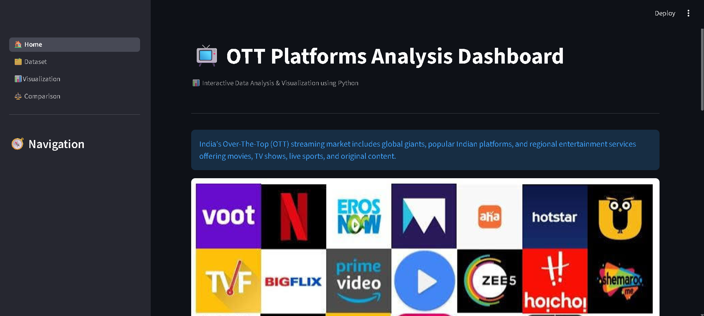
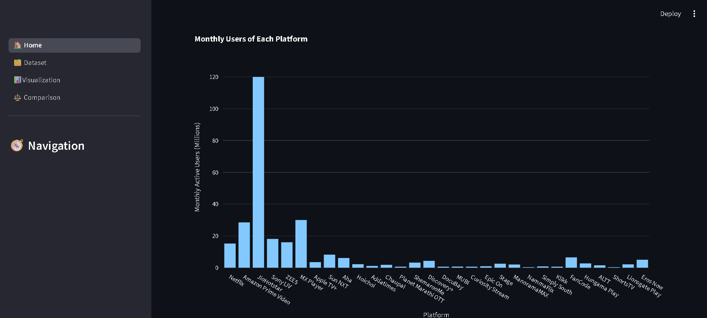
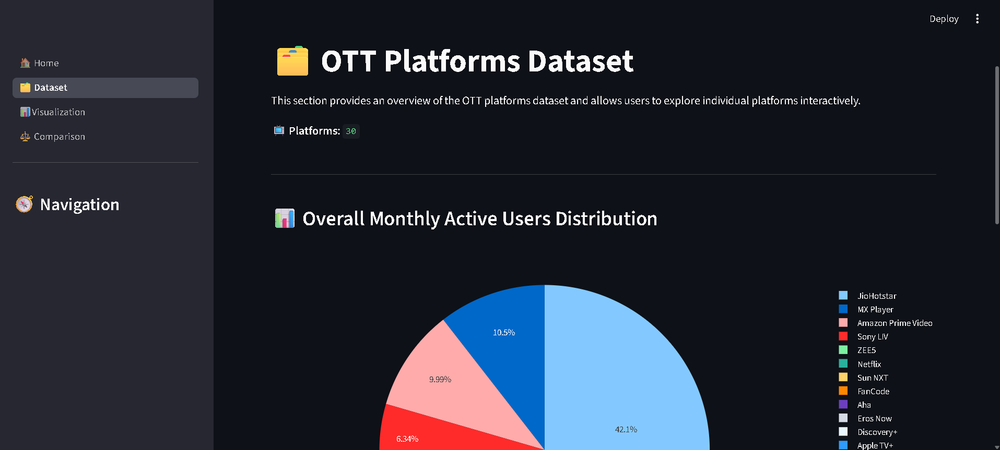
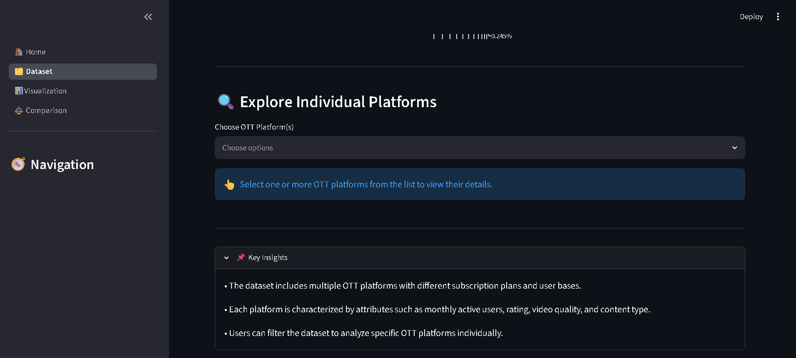
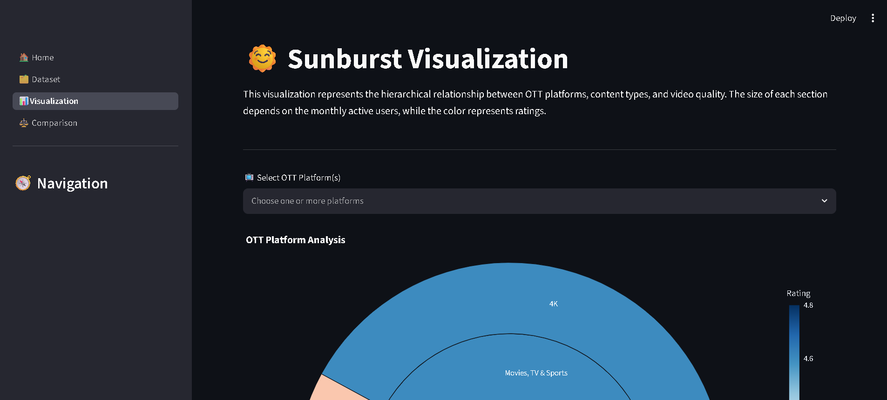
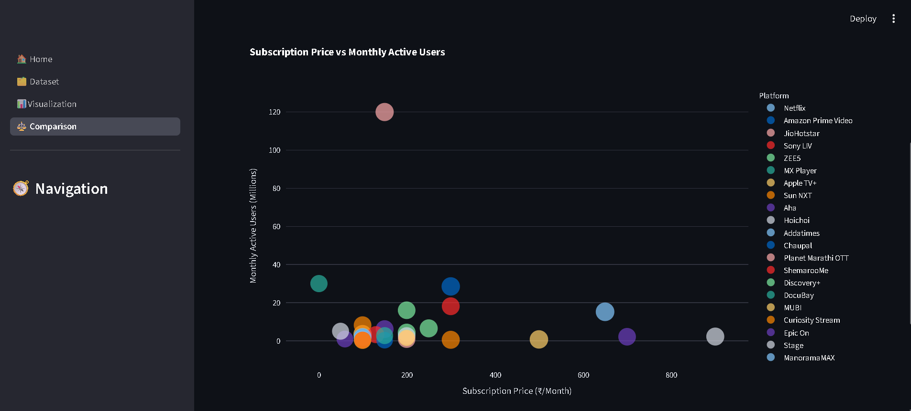

# 📺 OTT Platforms Analysis Dashboard

## Overview

The **OTT Platforms Analysis Dashboard** is an interactive data visualization project built using **Python, Streamlit, Pandas, Plotly, and Matplotlib**. It provides insights into popular OTT platforms by analyzing monthly active users, subscribers, subscription prices, ratings, content types, and video quality through interactive dashboards and visualizations.

---

## ✨ Features

* 🏠 Interactive Home Dashboard
* 🗂️ Dataset Exploration
* 🌞 Sunburst Visualization
* 📈 Scatter Plot Comparison (Subscription Price vs. Monthly Active Users Comparison)
* 🔍 Interactive Platform Filters
* ⚡ Dynamic Plotly Visualizations

---

## 📑 Dashboard Pages

### 🏠 Home

* Dashboard landing page
* Navigation to all analysis modules
* Project overview

### 🗂️ Dataset

* Displays the OTT platforms dataset
* Explore platform details and statistics

### 🌞 Visualization

* Interactive Sunburst chart for hierarchical OTT platform analysis

### 📈 Comparison

* ### 📈 Comparison

- Interactive scatter plot comparing **Subscription Price** and **Monthly Active Users**
- Analyze how subscription pricing relates to platform popularity and user engagement

---

## 🛠️ Technologies Used

* Python
* Streamlit
* Pandas
* Plotly Express
* Matplotlib

---

## 📂 Project Structure

```text
OTT-Analysis-Dashboard/
│
├── Datasets/
│   ├── OTT_Platforms.csv
│   ├── amazon_prime_titles.csv
│   └── netflix_titles.csv
│
├── Home.py
├── Dataset.py
├── Visualization.py
├── Comparison.py
├── ui.py
├── images.jpg
├── requirements.txt
├── README.md
├── .gitignore
└── screenshots/
    ├── Home.png
    ├── Home2.png
    ├── Dataset1.png
    ├── Dataset2.png
    └── Visualization.png
    └── Comparison.png
```

---

## 🚀 Installation

Clone the repository:

```bash
git clone <repository-url>
```

Install the required dependencies:

```bash
pip install -r requirements.txt
```

Run the Streamlit application:

```bash
streamlit run app.py
```

---

## 📸 Screenshots

### 🏠 Home Dashboard

Main dashboard with navigation and project overview.





---

### 🗂️ Dataset Page

Explore the OTT platforms dataset.




---

### 🌞 Visualization Page

Interactive Sunburst visualization of OTT platforms.



---

### 📈 Comparison Page

Scatter plot comparing Subscription Price and Monthly Active Users across OTT platforms.



---

## 🔮 Future Enhancements

* Add more OTT platforms
* Integrate real-time datasets
* Add advanced interactive visualizations
* Introduce KPI cards and analytics
* Improve filtering and search functionality

---

## 👩‍💻 Author

**Piya Kapoor**

B.Tech Computer Science Engineering

---

## 📄 License

This project is intended for educational and portfolio purposes.
